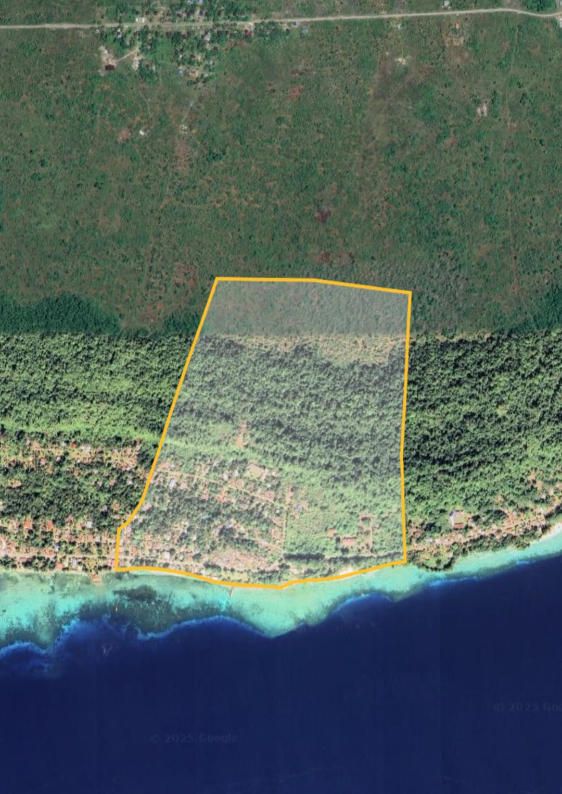
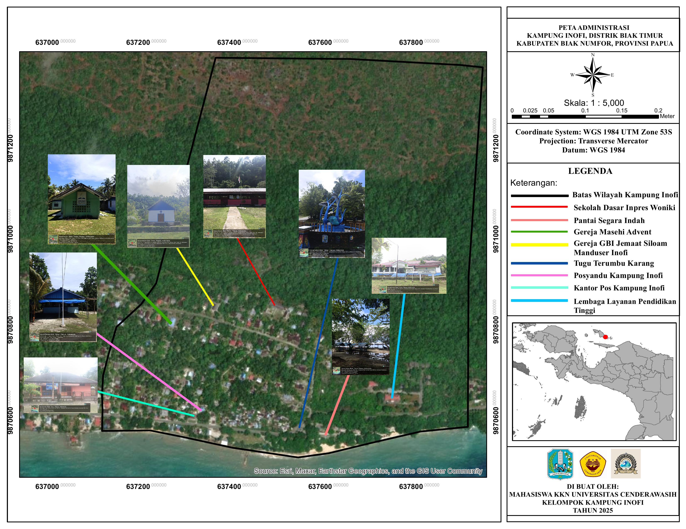
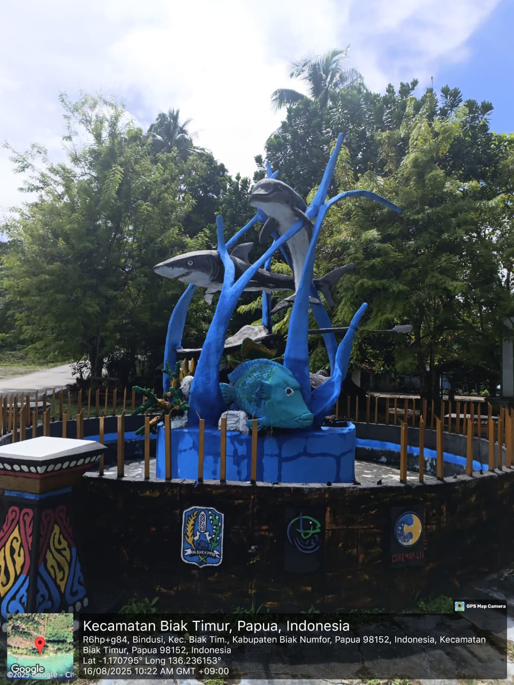

<html lang="id">
<head>
  <!-- Google tag (gtag.js) -->

  <meta charset="UTF-8">
  <meta name="viewport" content="width=device-width, initial-scale=1.0">
  <title>KAMPUNG INOFI</title>
  
</head>

<body>

<!-- Tombol menu -->
<button class="menu-button" onclick="openMenu()">☰</button>

<!-- Side menu -->

  &times;
  <a href="#" onclick="showSection('sejarah-singkat')">Sejarah Singkat</a>
  <a href="#" onclick="showSection('struktur-pemerintahan')">Struktur Pemerintahan</a>
  <a href="#" onclick="showSection('lokasi dan wilayah')">Lokasi dan wilayah</a>
  <a href="#" onclick="showSection('objek')">Objek Wisata</a>
  <a href="#" onclick="showSection('data-kampung')">Data Kampung</a>

<header>
  <h1>Selamat Datang di Kampung Inofi</h1>
  
Informasi  Kampung

</header>

<section id="sejarah-singkat" class="slide-section active">
  <h2>Sejarah Singkat</h2>
  
Kampung Inofi terletak di Distrik Biak Timur...

  <button onclick="toggleSlide('profil-lanjutan')">Lihat Selengkapnya</button>
  

    <h3>Sejarah Singkat Terbentuknya Kampung Inofi</h3>
    

      Kampung Inof sebelum terbentuk menjadi kampung definitif, mulanya adalah Dusun II dari Kampung Bindusi. Jadi, Inof pada awalnya adalah bagian dari Kampung Bindusi di Distrik Biak Timur, Kabupaten Biak Numfor. Pada tahun 1990 sampai 2011, jumlah penduduk Kampung Bindusi meningkat signifikan, namun pembangunan tidak dirasakan secara merata, terutama di Dusun II (Inof).
    

    

      Dengan dasar tersebut, Saudara <strong>Edmon Dimara, S.Sos</strong> menggagas pemekaran kampung dan mengajak masyarakat untuk mengusulkan pemekaran kampung kepada pemerintah daerah. Masyarakat merespons positif, dan Edmon membentuk <strong>Tim Kecil</strong> bernama <em>Tim Sembilan</em> untuk mengurus pemekaran.
    

    <h4 style="margin-top: 15px;">Anggota Tim Sembilan:</h4>
    <table style="black:100%; border-collapse: collapse; color: #211e1e;">
      <thead>
        <tr style="background-color: #426c9f;">
          <th style="padding: 8px; border: 1px solid #ccc;">No</th>
          <th style="padding: 8px; border: 1px solid #ccc;">Nama</th>
          <th style="padding: 8px; border: 1px solid #ccc;">Jabatan</th>
          <th style="padding: 8px; border: 1px solid #ccc;">Perwakilan</th>
        </tr>
      </thead>
      <tbody>
        <tr><td>1</td><td>Edmon Dimara, S.Sos</td><td>Ketua</td><td>-</td></tr>
        <tr><td>2</td><td>Lamek N. Inggamer</td><td>Sekretaris</td><td>-</td></tr>
        <tr><td>3</td><td>Dominggus Inggamer</td><td>Anggota</td><td>Marga Inggamer</td></tr>
        <tr><td>4</td><td>Yohanis Ronsumbre</td><td>Anggota</td><td>Marga Ronsumbre</td></tr>
        <tr><td>5</td><td>Albertus Manggombo</td><td>Anggota</td><td>Marga Manggombo</td></tr>
        <tr><td>6</td><td>Lodwik Dimara</td><td>Anggota</td><td>Marga Dimara</td></tr>
        <tr><td>7</td><td>Dance Dimara</td><td>Anggota</td><td>Tokoh Masyarakat</td></tr>
        <tr><td>8</td><td>Marthen L.S. Parorrongan</td><td>Anggota</td><td>Tokoh Agama</td></tr>
        <tr><td>9</td><td>Elisabeth Obabur</td><td>Anggota</td><td>Tokoh Perempuan</td></tr>
      </tbody>
    </table>

    

      Tim ini mulai menyiapkan administrasi penting untuk mengusulkan pemekaran. Tahun 1997 mereka mengirim surat ke Kepala Kampung Bindusi, Bapak Matheus Kurni (alm), yang merespons positif. Kepala Kampung ikut membantu proses surat menyurat kepada pemerintah Biak Numfor.
    

    

      Hasilnya, pada akhir 1998, DPRD Biak Numfor menetapkan Inof sebagai <strong>Kampung Pilot Proyek</strong>. Pada September 1999, Kepala Distrik Biak Timur <strong>Agus Filma, S.Sos</strong> meresmikan Inof sebagai kampung persiapan dan menunjuk <strong>Paulus Dimara, S.IP</strong> sebagai pelaksana tugas administratif.
    

    

      Tahun 2012, Bupati Biak Numfor <strong>Yusuf Maryen</strong> menetapkan 60 kampung pemekaran termasuk Inof, dan menunjuk pejabat serta kaur pemerintahan untuk pelayanan masyarakat. Tahun 2014 kampung ini masuk dalam agenda pemilihan kepala kampung definitif, dan pada Maret 2015, <strong>Michael Ronsumbre</strong> terpilih menjadi kepala kampung pertama.
    

    

      Nama awal kampung ini adalah “<strong>Inof</strong>”, namun pada surat resmi Kementerian Dalam Negeri tahun 2018, mengalami perubahan menjadi “<strong>Inofi</strong>” dengan penambahan huruf “i”.
    

    

      Sumber: Lamek N. Inggamer – Sekretaris Tim IX 
    

  

</section>

<section id="struktur-pemerintahan" class="slide-section">
  <h2>Struktur Pemerintahan</h2>
  <ul>
    <li>Pj Kepala Kampung:Markus yarangga S.IP </li>
    <li>Sekretaris: Lamek N. Inggamer</li>
  </ul>
  <button onclick="toggleSlide('struktur-lanjutan')">Lihat Selengkapnya</button>

  

    <h3 style="text-align:center;">Struktur Pemerintahan Kampung Inofi</h3>

    

      <!-- Kepala Distrik -->
      
Kepala Distrik

      

      <!-- Kepala Kampung dan Bamuskam sejajar -->
      

        <!-- Garis vertikal dari Kepala Distrik -->
        

        <!-- Kotak sejajar + garis horizontal -->
        

          
Bamuskam

          

          
Kepala kampung

        

      

      <!-- Garis ke Sekretaris -->
      

      
Sekretaris

      

      <!-- Garis ke Kaur -->
      

      

        

        

          
Kaur. Kesra

          
Kaur. Administrasi

          
Kaur. Keuangan

          
Kaur. Umum

          
Kaur. Pembangunan

          
Kaur. Pemerintah

        

      

      <!-- Garis ke RW -->
      

      

        

        

          
Ketua RW 01

          
Ketua RW 02

        

      

      <!-- Garis ke RT -->
      

      

        

        

          
Ketua RT 01

          
Ketua RT 02

          
Ketua RT 03

          
Ketua RT 04

        

      

    

    

      *Struktur ini berdasarkan dokumen resmi Pemerintahan Kampung Inofi.
    

  

</section>

<section id="lokasi dan wilayah" class="slide-section">
  <h2>Lokasi dan Wilayah</h2>
  
Kampung Inofi terletak di distrik biak timur kabupaten biak numfor, dibagian timur berbatasan dengan kampung soryar,
     di bagian barat berbatasan dengan kampung bindusi, di bagian utara berbatasan dengan laut dan sebelah selatan berbatasan dengan kampung insumarires.

  

    <!-- Peta Batas Wilayah -->
    

      
      
Ikon batas wilayah Kampung Inofi.

    

    <!-- Peta Administrasi -->
    

      
      
Peta Administrasi Kampung Inofi (Distrik Biak Timur).

    

  

</section>

<section id="objek" class="slide-section">
  <h2>Objek Wisata</h2>
  <ul class="objek-wisata">
    <li>
      <figure style="margin:0;">
        
        <figcaption style="color: white; margin-top: 8px;">Pemandangan pantai Segara Indah</figcaption>
      </figure>
    </li>
    <li>
      <figure style="margin:0;">
        
        <figcaption style="color: rgb(255, 255, 255); margin-top: 8px;">TUGU TERUMBU KARANG</figcaption>
      </figure>
    </li>
  </ul>
</section>

<section id="data-kampung" class="slide-section">

  <h2>Data Kampung Inofi</h2>
  <table style="width:100%; border-collapse: collapse; background-color: rgba(66, 108, 159, 0.8); color: hsl(0, 3%, 6%);">
    <thead>
      <tr style="background-color: #2f5b8a;">
        <th style="padding: 8px; border: 1px solid #ccc;">No</th>
        <th style="padding: 8px; border: 1px solid #ccc;">Data</th>
        <th style="padding: 8px; border: 1px solid #ccc;">Keterangan</th>
      </tr>
    </thead>
    <tbody>
      <tr>
        <td style="padding: 8px; border: 1px solid #ccc;">1</td>
        <td style="padding: 8px; border: 1px solid #ccc;">Nama Kampung</td>
        <td style="padding: 8px; border: 1px solid #ccc;">Inofi</td>
      </tr>
      <tr>
        <td style="padding: 8px; border: 1px solid #ccc;">2</td>
        <td style="padding: 8px; border: 1px solid #ccc;">Distrik</td>
        <td style="padding: 8px; border: 1px solid #ccc;">Biak Timur</td>
      </tr>
      <tr>
        <td style="padding: 8px; border: 1px solid #ccc;">3</td>
        <td style="padding: 8px; border: 1px solid #ccc;">Kabupaten</td>
        <td style="padding: 8px; border: 1px solid #ccc;">Biak Numfor</td>
      </tr>
      <tr>
        <td style="padding: 8px; border: 1px solid #ccc;">4</td>
        <td style="padding: 8px; border: 1px solid #ccc;">Provinsi</td>
        <td style="padding: 8px; border: 1px solid #ccc;">Papua</td>
      </tr>
      <tr>
        <td style="padding: 8px; border: 1px solid #ccc;">5</td>
        <td style="padding: 8px; border: 1px solid #ccc;">Jumlah Penduduk</td>
        <td style="padding: 8px; border: 1px solid #ccc;">± 243</td>
      </tr>
      <tr>
        <td style="padding: 8px; border: 1px solid #ccc;">6</td>
        <td style="padding: 8px; border: 1px solid #ccc;">Luas Wilayah</td>
        <td style="padding: 8px; border: 1px solid #ccc;">± 1.125.000 km²</td>
      </tr>
      <tr>
        <td style="padding: 8px; border: 1px solid #ccc;">7</td>
        <td style="padding: 8px; border: 1px solid #ccc;">Mata Pencaharian</td>
        <td style="padding: 8px; border: 1px solid #ccc;">Nelayan, Petani, Pedagang</td>
      </tr>
    </tbody>
  </table>

  

    *Data ini bersifat sementara dan dapat berubah sesuai perkembangan kampung.
  

</section>

<footer>
  
&copy; KAMPUNG INOFI 2025

</footer>

</body>
</html>
